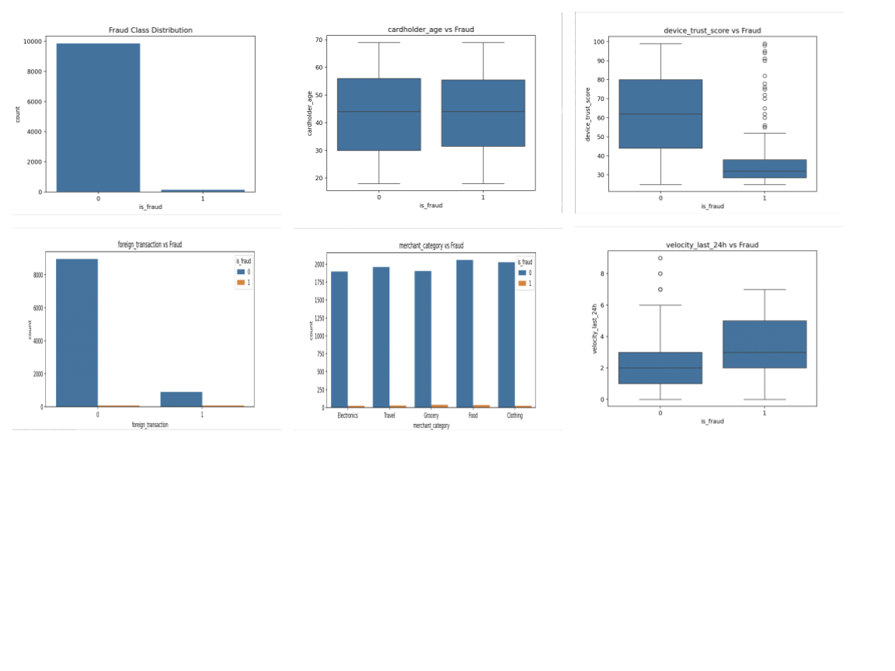
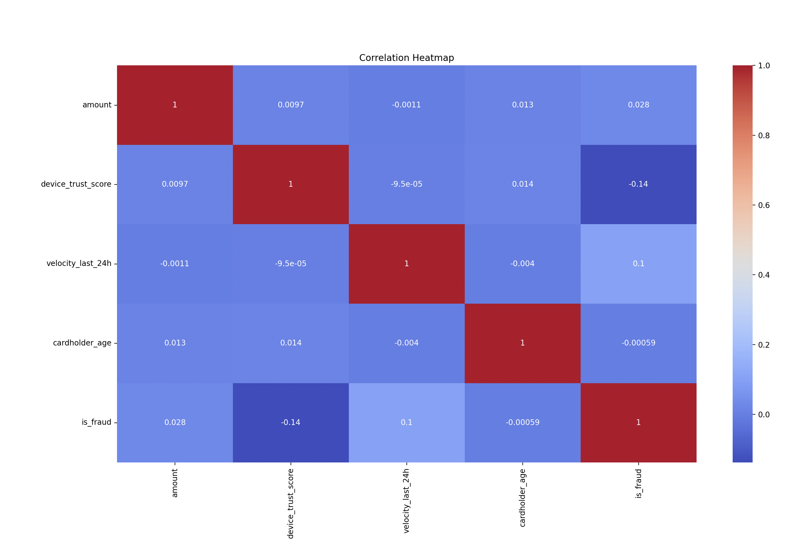
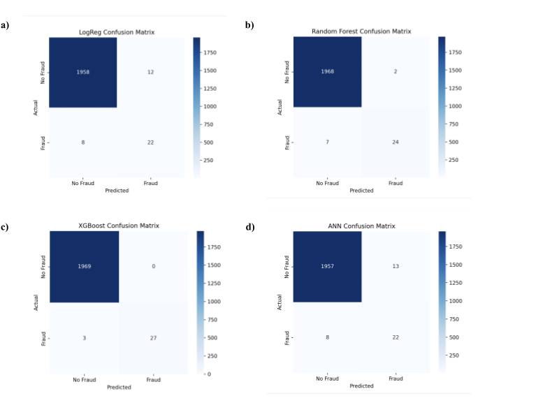
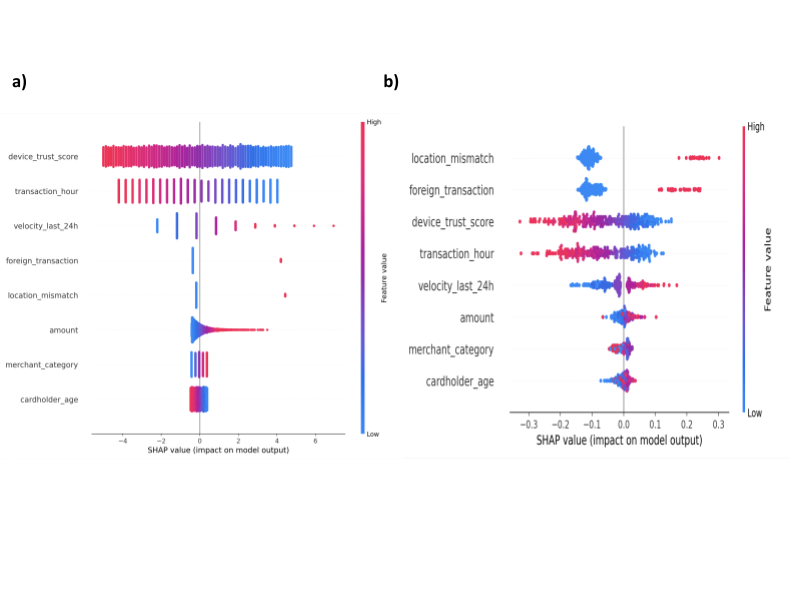

# Comparative Performance of Tree-Based and Neural Models for Credit Card Fraud Detection

**Author:** Rohan Srikanth (Denmark High School)  
**Research Mentor:** Dr. Ganesh Mani (Carnegie Mellon University)

This repository contains the implementation of my research paper on identifying fraudulent transactions in highly imbalanced datasets (1.51% fraud rate). This study evaluates the trade-offs between linear, ensemble, and neural models, with a focus on **explainability (XAI)** and **class imbalance handling**.

## 📊 Key Research Findings
The study found that **XGBoost** significantly outperformed the Artificial Neural Network (ANN) on this 10k-sample dataset.

| Model | Precision | F1-Score | AUC-ROC |
| :--- | :--- | :--- | :--- |
| **XGBoost** | **98.67%** | **93.17%** | **99.92%** |
| Random Forest | 93.90% | 85.18% | 99.90% |
| ANN | 64.39% | 67.82% | 99.11% |

**Key Insight:** SHAP analysis revealed that `device_trust_score` and `transaction_velocity` are the most significant behavioral predictors of fraud, while `cardholder_age` had negligible impact.
## 📈 Technical Analysis & Interpretability

While the formal JHSS submission is text-only per journal guidelines, the key technical visualizations below demonstrate the data distribution, feature relationships, and model logic.

### Exploratory Data Analysis

*Figure 1: Highlighting the severe 1.51% class imbalance and behavioral shifts in device trust and transaction velocity.*

### Feature Correlation

*Figure 2: Pearson correlation matrix showing the relationship between behavioral features and fraud status.*

### Model Performance (Confusion Matrices)

*Figure 3: Side-by-side comparison showing XGBoost's superior ability to minimize false negatives compared to Logistic Regression and ANNs.*

### Explainable AI (SHAP Analysis)

*Figure 4: SHAP summary plots proving that lower device trust scores are the primary global driver for fraud identification.*

## 🛠️ Technical Implementation
*   **Imbalance Handling:** Utilized **SMOTE** (Synthetic Minority Over-sampling Technique) to address the severe class imbalance prior to training.
*   **Validation Strategy:** Implemented **5-fold stratified cross-validation** to ensure model robustness.
*   **Interpretability:** Integrated **SHAP (SHapley Additive exPlanations)** to interpret high-stakes model decisions.
*   **Optimization:** Applied gradient boosting to minimize the loss function specifically for the minority (fraud) class.

## 📁 Repository Structure
*   `XGBoost.py`: Best performing model implementation.
*   `randomForest.py`: Ensemble tree-based implementation.
*   `artificalNeuralNetwork.py`: Multi-layer perceptron implementation.
*   `logisticRegression.py`: Baseline linear model for comparison.

## 🚀 How to Run
1. Clone the repo: `git clone https://github.com`
2. Install dependencies: `pip install xgboost shap imbalanced-learn pandas scikit-learn`
3. Dataset source: [Credit Card Fraud Detection Dataset (Arif Miah)](https://www.kaggle.com)

---
*This research was submitted to the Journal of High School Science (JHSS).*
